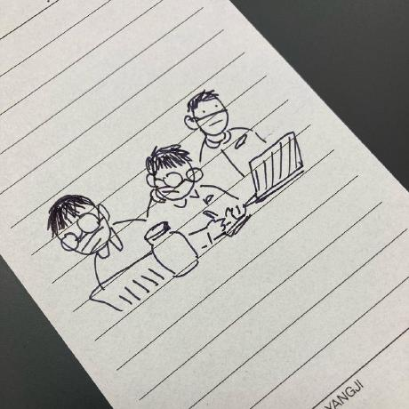
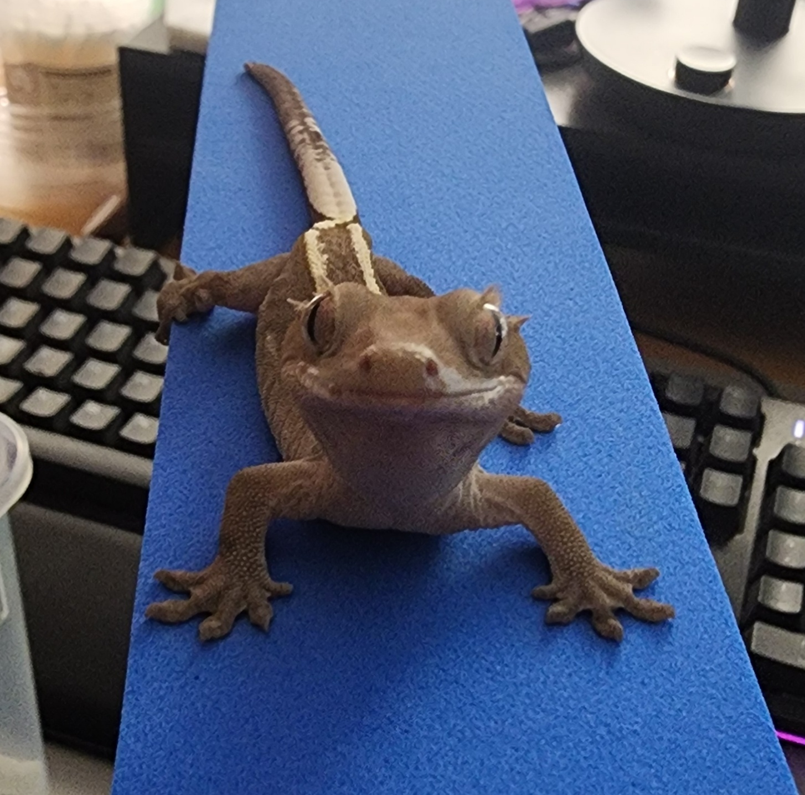
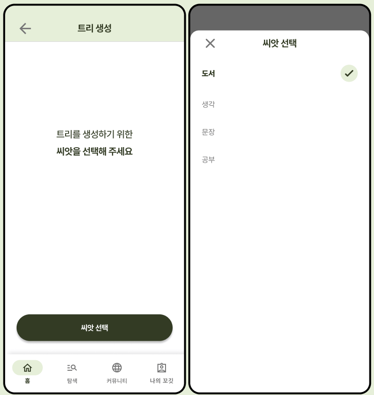
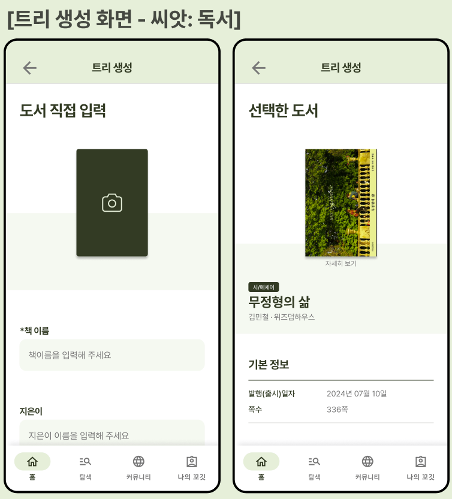
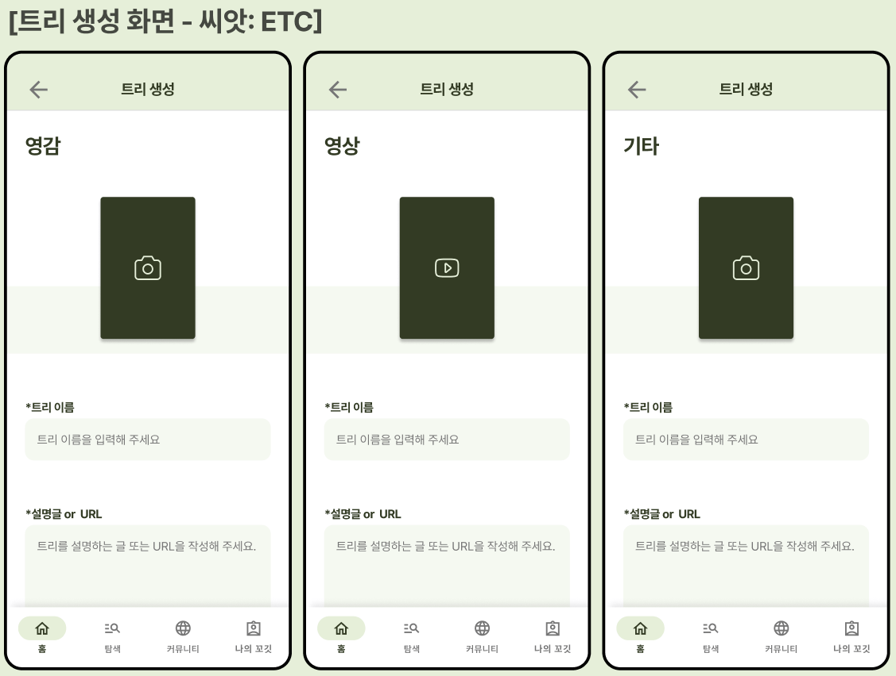

#  Project 꼬깃
## 프로젝트 참여 인원
### 🎨 Designers
<a href="https://github.com/TaegyuHan" style="display: block; margin-left: 30px; margin-bottom: 5px; font-family: 'Pretendard', sans-serif; font-weight: bold; font-size: 20px; color: #e5eddb;">

김은서
</a>

### 💻 Developers

<a href="https://github.com/Jomalang" style="display: block; margin-left: 30px; margin-bottom: 5px; font-family: 'Pretendard', sans-serif; font-weight: bold; font-size: 20px; color: #e5eddb;">
  
  조현진
</a>
<a href="https://github.com/TaegyuHan" style="display: block; margin-left: 30px; margin-bottom: 5px; font-family: 'Pretendard', sans-serif; font-weight: bold; font-size: 20px; color: #e5eddb;">
  
  한태규
</a>
<a href="https://github.com/Gun-code" style="display: block; margin-left: 30px; margin-bottom: 5px; font-family: 'Pretendard', sans-serif; font-weight: bold; font-size: 20px; color: #e5eddb;">
  
  이희권
</a>
<a href="https://github.com/jjustcodding" style="display: block; margin-left: 30px; margin-bottom: 5px; font-family: 'Pretendard', sans-serif; font-weight: bold; font-size: 20px; color: #e5eddb;">
  
  장재영
</a>
<a href="https://github.com/pilpearl" style="display: block; margin-left: 30px; margin-bottom: 5px; font-family: 'Pretendard', sans-serif; font-weight: bold; font-size: 20px; color: #e5eddb;">
  
  주진필
</a>

---
## 목차
<!-- TOC -->
* [ Project 꼬깃](#-project-꼬깃)
  * [프로젝트 참여 인원](#프로젝트-참여-인원)
    * [🎨 Designers](#-designers)
    * [💻 Developers](#-developers)
  * [목차](#목차)
  * [프로젝트 개요](#프로젝트-개요)
    * [프로젝트 개발 배경 및 설명](#프로젝트-개발-배경-및-설명)
      * [개발 배경](#개발-배경)
      * [일상 기록의 문제점](#일상-기록의-문제점)
    * [프로젝트 주요 기능 및 기대효과](#프로젝트-주요-기능-및-기대효과)
    * [프로젝트 환경 및 개발 언어](#프로젝트-환경-및-개발-언어)
  * [버전 및 업데이트 정보](#버전-및-업데이트-정보)
<!-- TOC -->

---
## 프로젝트 개요
기록을 좋아하는 사람, 기록 습관을 만들고 싶은 사람, 그리고 기록을 효율적으로 관리하고 싶은 사람들을 위한 기록 관리 서비스, 꼬깃을 소개합니다.\
꼬깃은 기록 작성부터 체계적인 관리까지 다양한 기능을 제공하여, 기록을 보다 효율적이고 직관적으로 활용할 수 있도록 돕습니다.\
이제 꼬깃과 함께 기록을 정리하고 집중화된 관리의 편리함을 경험해보세요!
### 프로젝트 개발 배경 및 설명
#### 개발 배경
- **📖독서 기록**\
    독서를 좋아하고 글쓰기를 사랑하는 조현진님의 아이디어로 장소에 구애받지 않고 독서를 기록하고 싶었던 그는 직접 온라인으로 서비스를 만들고자 하였습니다.
- **📜기록의 확장**\
    기록의 잠재력은 독서에만 국한되지 않고 주제에 따라 일상 전반을 기록하고 관리하며 새로운 영감을 창출해내는 서비스로 확장되었습니다.

#### 일상 기록의 문제점
- **제한적인 공간**\
  기록을 작성하고 관리하는 공간이 제한적이며, 기록을 작성하기 위해선 펜과 수첩, 노트 등을 항상 준비해야 하는 번거로움이 있습니다.
- **기록들의 파편화**\
  수첩에 적은 기록, 스마트폰에 저장한 기록, 컴퓨터에 저장한 기록 등 기록들이 각기 다른 매개체에 다른 방법으로 저장되어 있어, 필요한 기록을 찾기 위해선 많은 시간이 소요되며 찾을수 없는 경우도 발생합니다.
- **일관되지 않은 형식**
    기록을 작성할 때마다 형식이 일관되지 않아, 기록을 작성한 후에도 기록을 찾기 위해선 기록의 내용을 다시 확인해야 하는 번거로움이 있습니다.
### 프로젝트 주요 기능 및 기대효과
- **기록 방식(트리 구조)**

  
꼬깃의 기록은 3단계를 거쳐 작성됩니다.
1. 씨앗 생성(기록의 주제)\
  씨앗은 기록의 대주제를 의미하며, '독서', '생각', '문장', '공부' 등의 주제로 구성됩니다.

2. 트리 생성(기록의 방향성)\
  트리는 씨앗을 기준으로 세부적인 주제를 나누어 기록의 방향성을 설정하며,\
  '독서' 씨앗의 경우 알라딘 API 연동을 통해 도서 정보를 검색하며, 직접 도서를 등록하여 기록할 수 있습니다.\
  그 외 '생각', '문장', '공부' 등의 씨앗의 경우 직접 주제를 생성하여 기록할 수 있습니다.\

3. 리프 생성(기록의 내용)

- **기능 2**
### 프로젝트 환경 및 개발 언어
## 버전 및 업데이트 정보