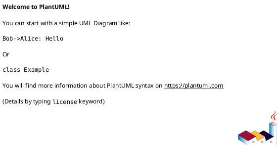

# <동작 유무> 명세서

## <동작 유무 등록> 유스케이스
목표: <어떠한 동작을 하기 위함을 작성>

액터: <동작을 발생 시키는 자를 작성>

사전 조건:
- <동작이 발생하기 위함을 작성>

트리거:
- <동작을 발생하는 지점을 작성>

main flow:
1. <동작이 발생하는 과정을 작성>

Exception flow:

- <동작이 정상적으로 발생 안하는 예외 과정을 작성>
    1. <예외가 발생하고 처리할 과정을 작성>

PostCondition:
- <동작이 정상적으로 발생했을 때의 결과를 작성>

## <> 시퀀스 다이어그램

