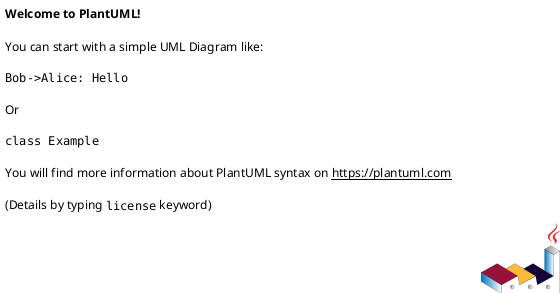

# 도서 트리 리프 첫 생성 명세서

## 도서 트리 리프 첫 생성 유스케이스
목표: 도서 트리 리프의 첫 생성.

액터: 사용자

사전 조건:
- 사용자는 로그인 되어 있어야 한다.
- 사용자는 트리 탬프가 생성되어 있어야 한다.

트리거:
- 사용자가 트리의 첫번째 리프를 생성한다.

main flow:

유효성 검사
1. 사용자는 트리의 첫번째 리프의 정보를 입력한다.
2. 시스템은 입력 받은 리프 정보의 유효성을 검사한다.
3. 시스템은 첫 생성 리프인지 확인한다.

트리 및 도서 생성
3. 시스템은 트리 탬프의 정보를 조회한다.
4. 시스템은 직접 등록 도서여부와  API도서 여부를 확인한다.
   1. 직접 등록 도서
      1. 시스템은 도서를 생성한다.
      2. 시스템은 도서 이미지 파일을 저장한다.
   1. API 도서
      1. 시스템은 API도서를 조회한다.
5. 시스템은 트리, 트리 이미지, 트리 총 읽은 페이지를 저장한다.

리프 생성
6. 시스템은 입력받은 태그의 존재를 확인한다.
7. 시스템은 리프 이미지 저장
   1. 시스템은 리프 이미지 파일 위치를 변경한다.
   2. 시스템은 리프 이미지 경로 내용을 수정한다.
8. 시스템은 리프를 저장한다.
9. 시스템은 리프의 이미지 파일 정보를 저장한다.
10. 시스템은 리프의 읽은 페이지 정보를 저장한다.
11. 시스템은 리프의 태그 맵핑 정보를 저장한다.
12. 시스템은 도서 트리의 읽은 정보를 업데이트한다.

Exception flow:

- 사용자가 로그인
  1. 사용자가 로그인 되어 있지 않는 경우

- 유효성 검사
  1. 사용자가 입력한 리프 정보가 유효하지 않은 경우
    
- 탬프 트리
  1. 사용자의 탬프 트리가 존재하지 않는 경우

- 도서
  1. 직접 등록 도서
     1. 도서 생성에 실패한 경우
     2. 도서 이미지 파일 저장에 실패한 경우
  2. API 도서
     1. API 도서 조회에 실패한 경우

- 리프 태그 
    1. 태그가 존재하지 않는 경우

- 리프
  1. 리프 이미지 저장에 실패한 경우
  2. 리프 저장에 실패한 경우
     3. 리프 읽은 페이지가 총 페이지보다 큰 경우
  3. 리프 이미지 파일 정보 저장에 실패한 경우
  4. 리프 읽은 페이지 정보 저장에 실패한 경우

- 리프 태그 맵핑
  1. 태그 맵핑 정보 저장에 실패한 경우

- 읽은 정보 저장
  1. 도서 트리의 읽은 정보 업데이트에 실패한 경우

PostCondition:
- 도서 첫번째 리프가 생성된다.

### API
POST `/api/v1/leafs/book/first`
- Request: LeafBookFirstCreateRequest
- Response: LeafBookFirstCreateResponse

## <> 시퀀스 다이어그램

