# 개발 작업 Process 가이드

## 개요
git을 사용하여 프로젝트를 진행하면서 자신의 업무의 진행상황과 협업자들의 업무 진행상황을 파악하기 위한 가이드입니다.

## 프로젝트 중 발생중인 문제
- 서로 개발중인 작업과 진행상황을 파악하기 어려움
- code commit 단위가 너무 큼 > 코드리뷰와, 코드 파악이 어려움
- 작업자의 코드 커밋 메시지가 통일성이 없어서 각자의 업무를 파악하기 어려움
- 코드 작성과 문서 정리 플랫폼이 분리되어 있어서, 작업자의 업무를 파악하기 어려움

## 해결 방안
1. 작업자의 업무 진행상황을 파악하기 위한 가이드 작성
2. 코드 커밋 단위를 작게하여 코드리뷰와, 코드 파악이 용이하도록 함
3. 코드 커밋 메시지의 통일성을 유지하도록 함
4. 코드 작성과 문서 정리 플랫폼을 통합하여 업무 파악이 용이하도록 함

## 1. 작업자의 업무 진행상황 가이드
작업자의 업무와 진행상황은 github의 issue를 통해서 관리하려고 합니다.

프로세스 순서는 다음과 같습니다.
1. github issue 생성
2. github issue에 작업 내용과 진행자를 작성 (템플릿에 맞춰 작성)
3. intellij에서 Task를 검색 후, 해당 Task를 선택하여 브랜치를 생성
4. 작업을 완료하면 commit log를 작성 (템플릿에 맞춰 작성)
5. 원격 저장소로 push
6. PR을 생성하여 코드리뷰 요청
7. 코드리뷰 후, merge
8. issue close

### 1.1. github issue 생성, 1.2. github issue에 작업 내용과 진행자를 작성
이슈를 생성하기 위해서 다음과 같은 템플릿을 사용합니다.
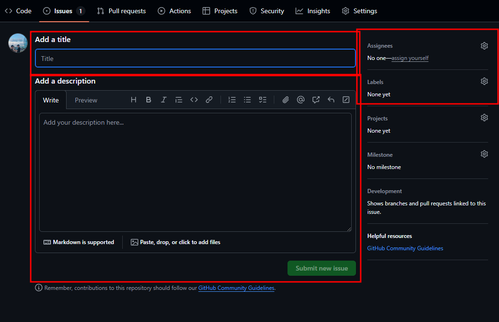

이슈 카테고리는 제목 앞에 붙여서 작성합니다.
- [기능] : 새로운 기능 추가
- [버그] : 버그 수정
- [리팩토링] : 코드 리팩토링
- [기타] : 기타
- [문서] : 문서 작업
- [테스트] : 테스트 코드 작성
- [설정] : 설정 파일 작성
- [CI/CD] : CI/CD 작업
- [빌드] : 빌드 작업
- [배포] : 배포 작업
- [보안] : 보안 작업
- [성능] : 성능 향상 작업

내용: 
```text
제목: [카테고리 명] 작업내용

담당자: 한태규
작업 내용: 작업내용을 작성합니다.
관련 이슈: #1225
작업 시작 일자: 2021-09-01

작업 상세 내욜
- [ ] 작업내용1
- [ ] 작업내용2
- [ ] 작업내용3
- [ ] 작업내용4

테스트 상세 내용
- [ ] 테스트 방법
- [ ] 테스트 방법
- [ ] 테스트 방법

작업 완료 예상 일자: 2021-09-01
작업 완료 일자: 2021-09-01

이전 작업 이슈: #1224
```

이슈 템플릿을 자동 생성 하기 위해서 다음과 같이 설정합니다.

이슈 템플릿은 github의 setting에서 설정할 수 있습니다.
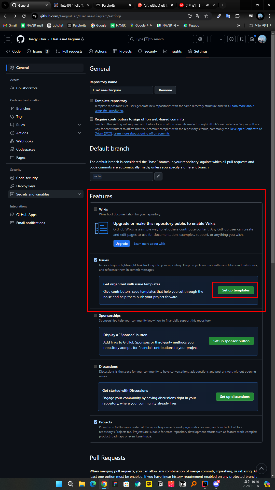
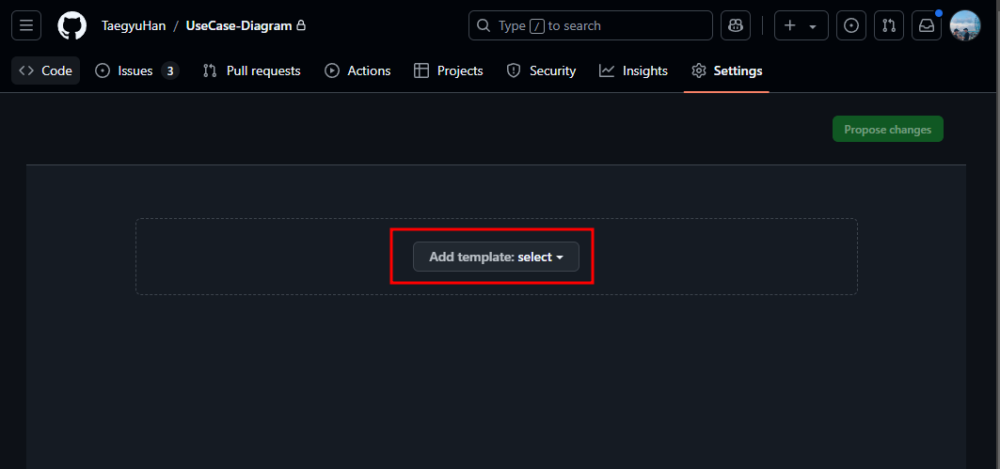
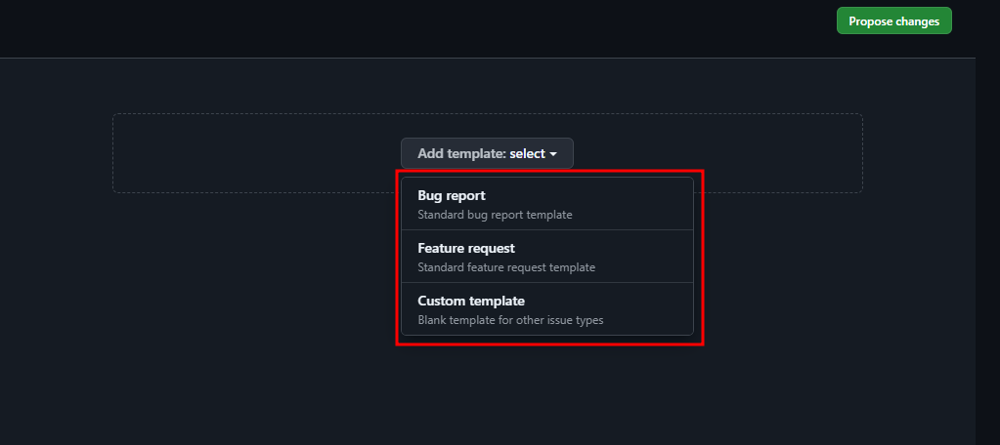
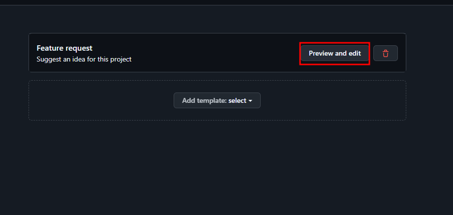 이슈 템플릿 수정
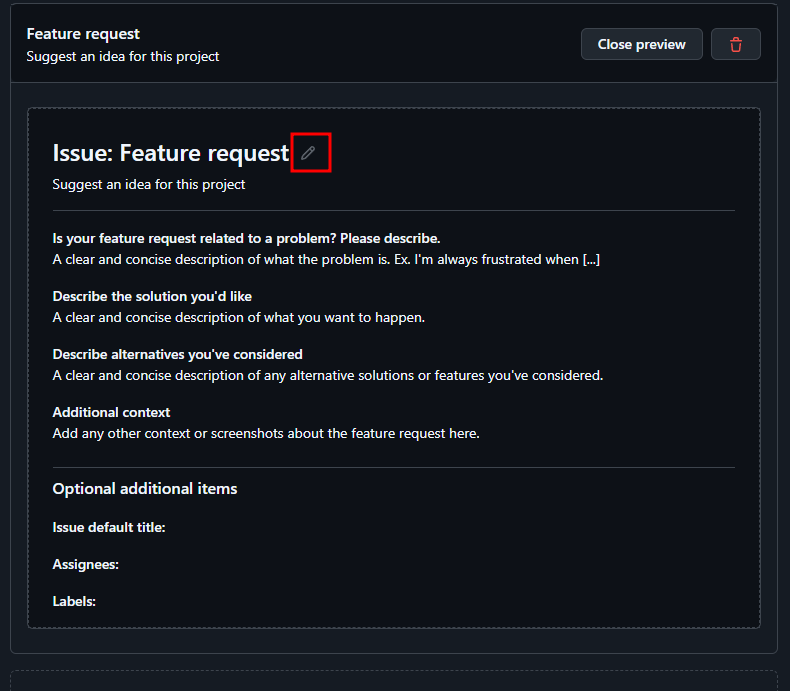
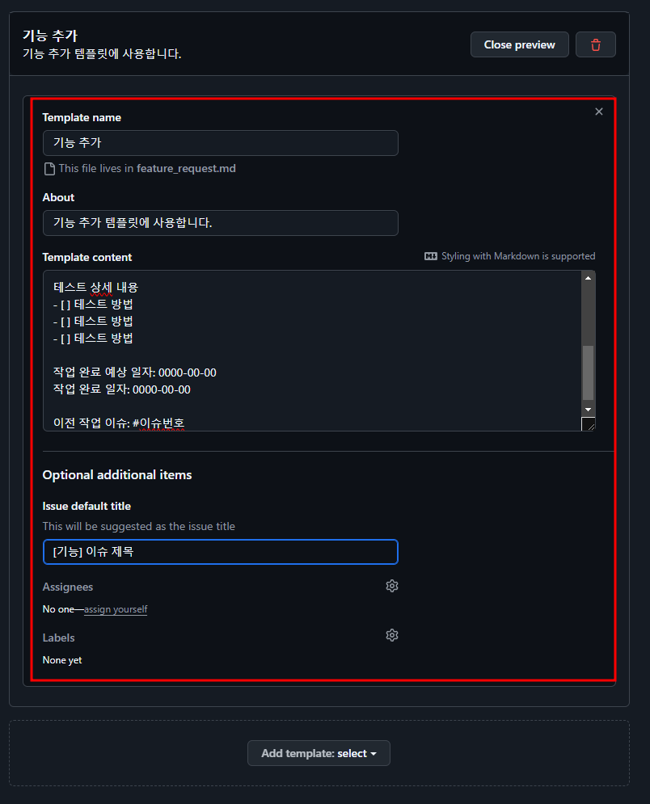
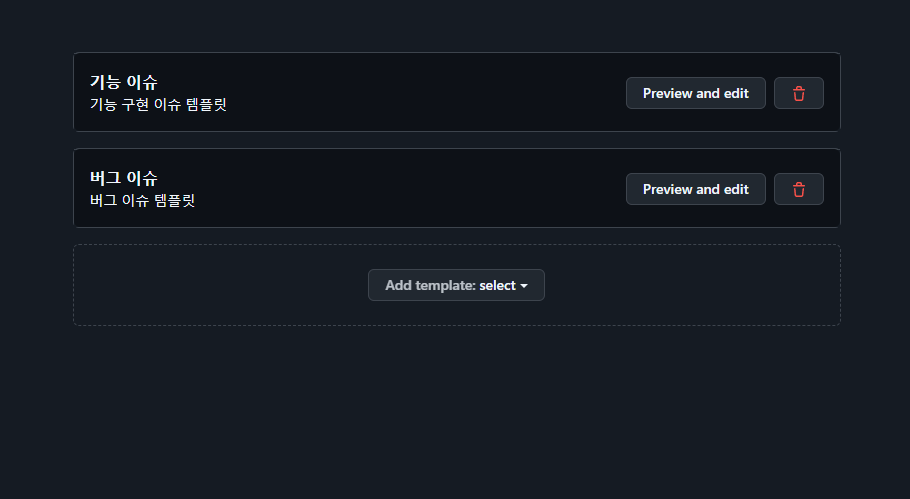
생성 완료

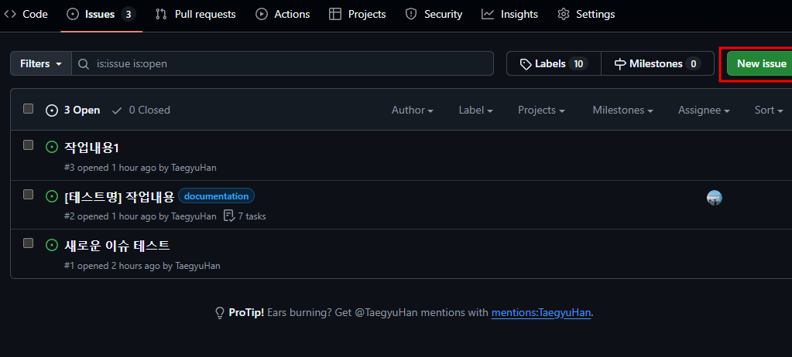
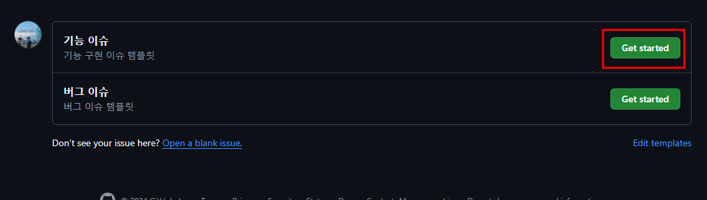
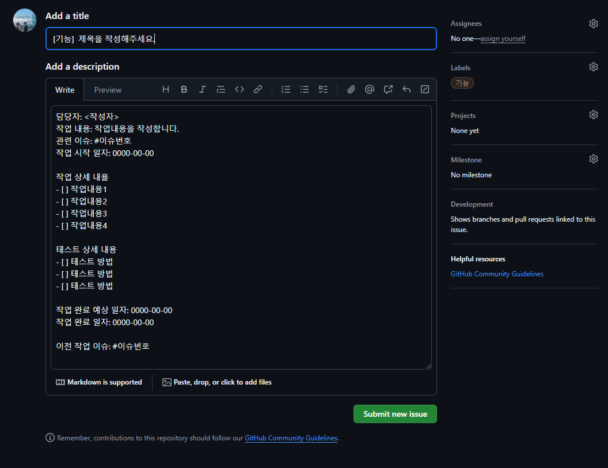
자동으로 이슈 템플릿 적용


### 1.3. intellij에서 Task를 검색 후, 해당 Task를 선택하여 브랜치를 생성

github에서 이슈를 생성하고 IntelliJ에서 해당 이슈를 선택하여 브랜치를 생성합니다.

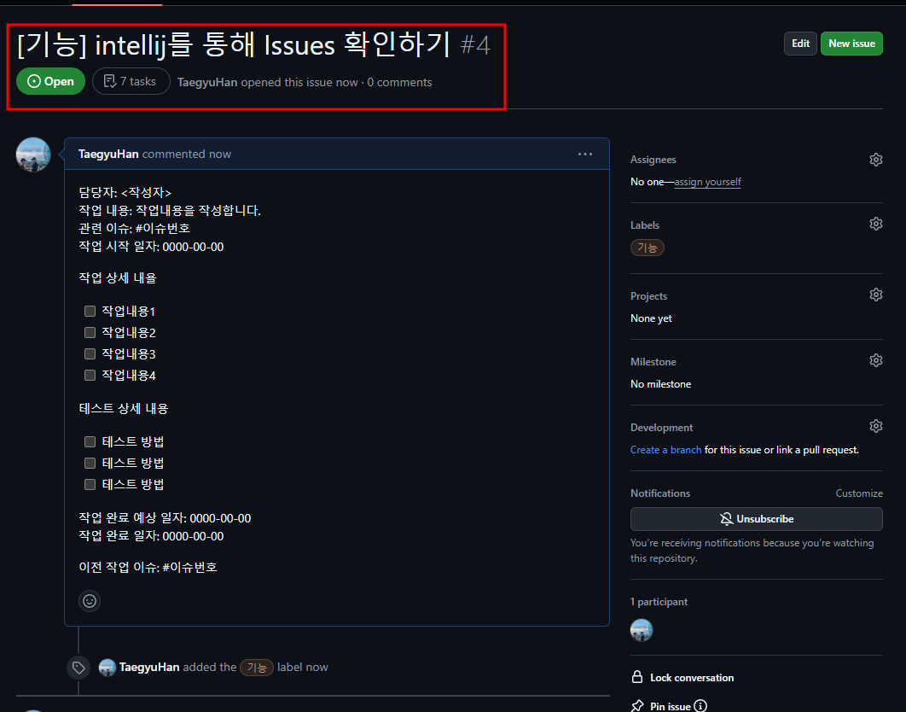
생성한 이슈

인텔리제이에서 해당 이슈를 검색하여 브랜치를 생성합니다.

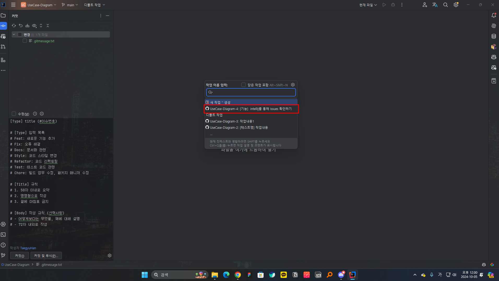
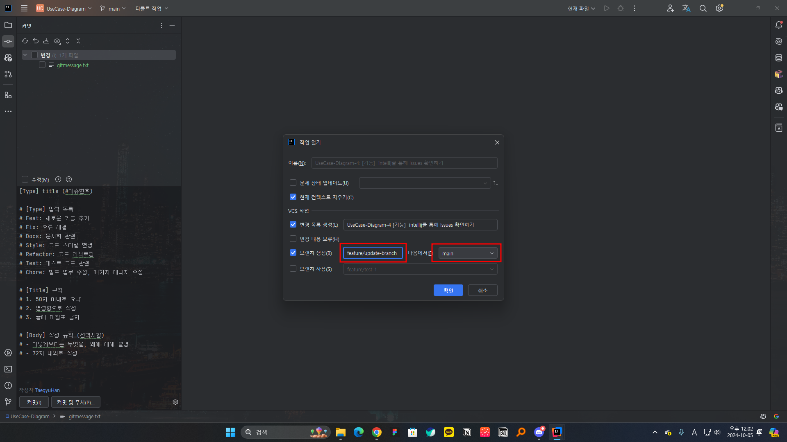
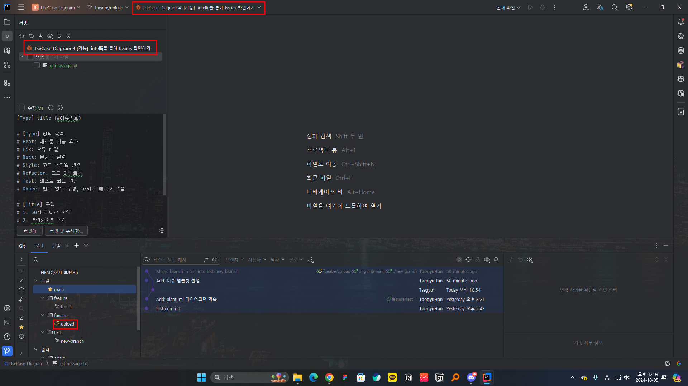
해당 업무를 위한 브랜치가 생성됨

### 1.4. 작업을 완료하면 commit log를 작성
커밋 템플릿을 설정하는 방법

`.gitmessage.txt` 파일을 생성하여 커밋 템플릿을 작성합니다.
파일은 프로젝트 루트에 생성합니다.

`.gitmessage.txt` 파일의 내용
```text
[Type] (#이슈번호) title

# [Type] 입력 목록
# Feat: 새로운 기능 추가
# Fix: 오류 해결
# Docs: 문서화 관련
# Style: 코드 스타일 변경
# Refactor: 코드 리팩토링
# Test: 테스트 코드 관련
# Chore: 빌드 업무 수정, 패키지 매니저 수정

# [Title] 규칙
# 1. 50자 이내로 요약
# 2. 명령형으로 작성
# 3. 끝에 마침표 금지

# [Body] 작성 규칙 (선택사항)
# - 어떻게보다는 무엇을, 왜에 대해 설명
# - 72자 내외로 작성
```

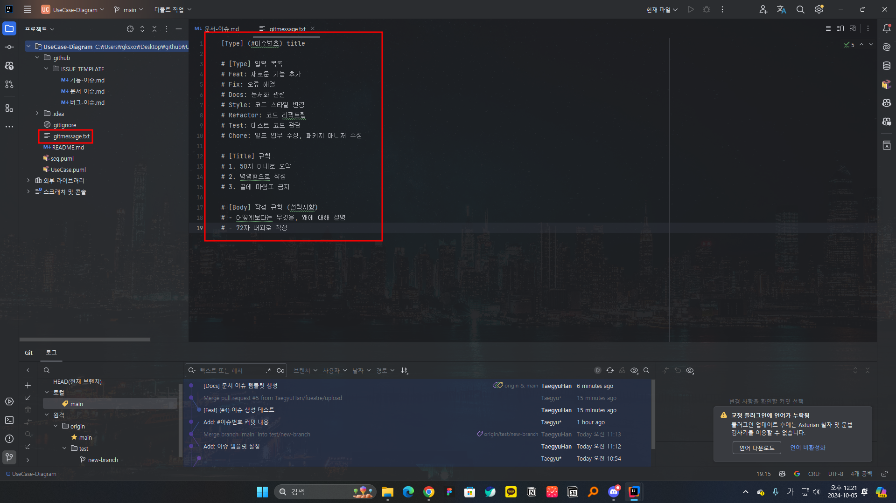

git에 등록하는 명령어는 아래와 같습니다.
```bash
git config --global commit.template .gitmessage.txt
```

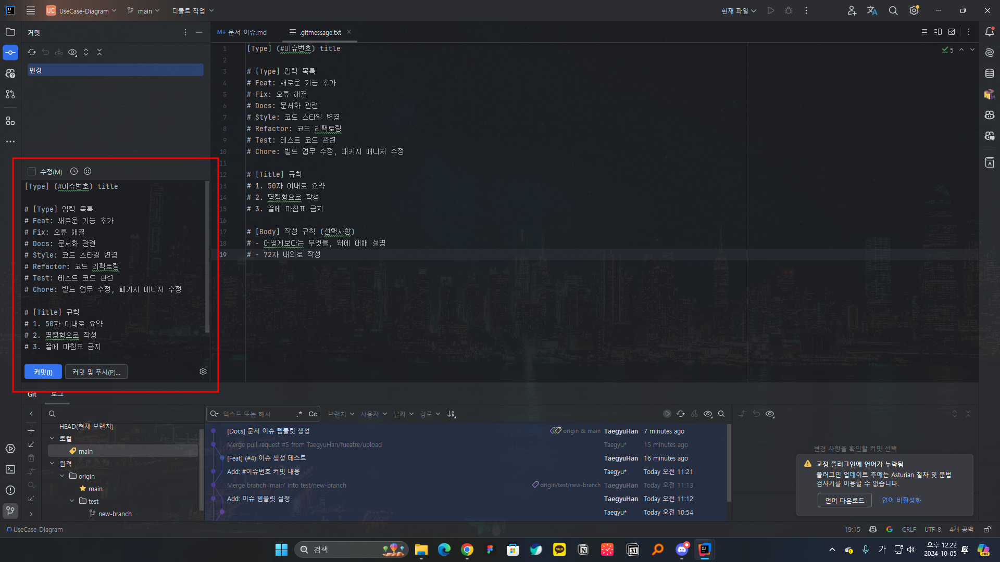
커밋전 자동으로 설정됩니다.

### 1.5. 원격 저장소로 push
커밋을 완료하면 원격 저장소로 push 합니다.

### 1.6. PR을 생성하여 코드리뷰 요청
### 1.7. 코드리뷰 후, merge