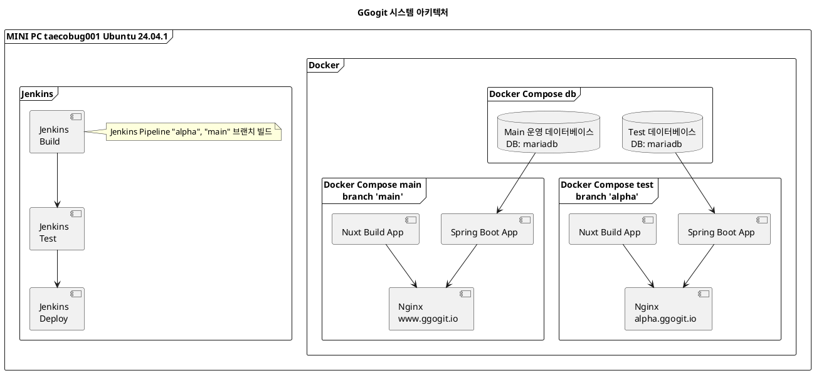

# 시스템 아키텍처

> 마지막 수정자: 한태규\
마지막 수정 날짜: 2024-12-11

---

## 목차
<!-- TOC -->
* [시스템 아키텍처](#시스템-아키텍처)
  * [목차](#목차)
  * [시스템 아키텍처](#시스템-아키텍처-1)
  * [`Docker Compose db` 구성](#docker-compose-db-구성)
  * [`Docker Compose test` 구성](#docker-compose-test-구성)
  * [`Docker Compose main` 구성](#docker-compose-main-구성)
<!-- TOC -->

---

## 시스템 아키텍처
GGogit 프로젝트 시스템 아키텍처입니다. 아래의 다이어그램은 시스템의 전체적인 구조를 보여줍니다.

## `Docker Compose db` 구성
2개의 데이터 베이스 존재 (운영 데이터베이스, 테스트 데이터베이스)
- 운영 데이터베이스: `mariadb`
운영에 사용되는 데이터베이스
  
- 테스트 데이터베이스: `mariadb`
테스트에 사용되는 데이터베이스

## `Docker Compose test` 구성
`alpha` 브랜치에 배포되는 컨테이너 구성 `alpha` 브랜치에 코드를 `PR` 하면 `jekins`를 통해 `alpha` 브랜치에 배포

- Spring Boot App: `testApp`
- Nuxt Build App: `testNuxt`
- Nginx: `testNginx`

빌드 순서
1. 코드 작성 후 `aplha` 브랜치에 `PR`
2. `github`에서 `Jenkins`로 `PR` 전달
3. `Jenkins`에서 `PR`을 받아 `test` 빌드
4. `Jenkins`에서 `test` 빌드 후 `test` 테스트
5. `Jenkins`에서 `test` 테스트 후 `test` 배포

## `Docker Compose main` 구성
`main` 브랜치에 배포되는 컨테이너 구성 `main` 브랜치에 코드를 `PR` 하면 `jekins`를 통해 `main` 브랜치에 배포

- Spring Boot App: `mainApp`
- Nuxt Build App: `mainNuxt`
- Nginx: `mainNginx`

빌드 순서
1. 코드 작성 후 `main` 브랜치에 `PR`
2. `github`에서 `Jenkins`로 `PR` 전달
3. `Jenkins`에서 `PR`을 받아 `main` 빌드
4. `Jenkins`에서 `main` 빌드 후 `main` 테스트
5. `Jenkins`에서 `main` 테스트 후 `main` 배포