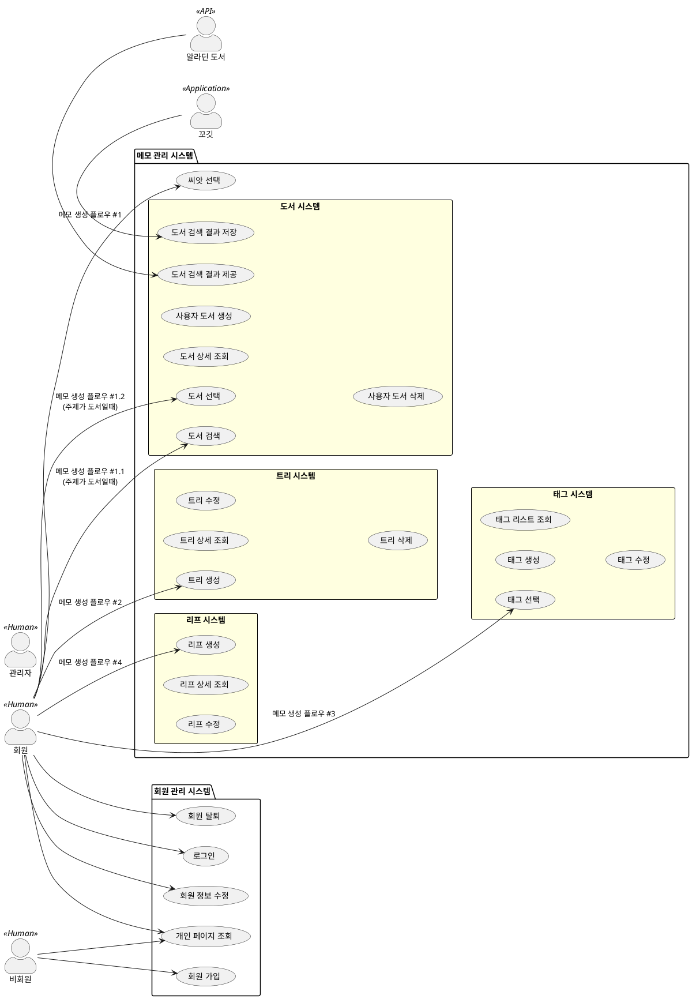

# 유즈케이스
> 마지막 수정자: 조현진\
마지막 수정 날짜: 2024-12-11

## PlantUML
> 💡(IntelliJ) PlantUML Integration 플러그인 설치 후 해당 기능 이용해 아래 코드를 렌더링된 이미지로 확인할 수 있습니다.

```plantuml
@startuml

left to right direction
skinparam actorStyle awesome
skinparam rectangle {
    BackgroundColor LightYellow
    BorderColor Black
    FontColor Black
}
:회원: as user <<Human>>
:비회원: as nonUser <<Human>>
:알라딘 도서: as aladin <<API>>
:관리자: as admin <<Human>>
:꼬깃: as ggogit <<Application>>
package "메모 관리 시스템" {
    (씨앗 선택) as pickSeed
    
    rectangle "도서 시스템" {
        (도서 선택) as pickBook
        (도서 검색) as searchBook
        (도서 상세 조회) as readBook
        (도서 검색 결과 제공) as provideSearchResult
        (도서 검색 결과 저장) as saveSearchResult
        (사용자 도서 생성) as createBook
        (사용자 도서 삭제) as deleteBook
    }
    rectangle "트리 시스템"{
        (트리 생성) as createTree
        (트리 상세 조회) as readTree
        (트리 수정) as updateTree
        (트리 삭제) as deleteTree
    }
    rectangle "태그 시스템" {
        (태그 생성) as createTag
        (태그 리스트 조회) as readTag
        (태그 선택) as pickTag
        (태그 수정) as updateTag
    }
    rectangle "리프 시스템"{
        (리프 생성) as createLeaf
        (리프 상세 조회) as readLeaf
        (리프 수정) as updateLeaf
    }
 }
 
 package "회원 관리 시스템" {
    (회원 가입) as signUp
    (로그인) as signIn
    (회원 정보 수정) as updateUserInfo
    (회원 탈퇴) as deleteUserInfo
    (개인 페이지 조회) as readUserPage
 }
    nonUser --> signUp 
    nonUser --> readUserPage
    
    user --> signIn
    user --> updateUserInfo
    user --> deleteUserInfo
    user --> readUserPage
    
    ggogit -left-> saveSearchResult
    aladin -left-> provideSearchResult
    
    user --> pickSeed : 메모 생성 플로우 #1
    user --> searchBook : 메모 생성 플로우 #1.1\n(주제가 도서일때)
    user --> pickBook : 메모 생성 플로우 #1.2\n(주제가 도서일때)
    user --> createTree : 메모 생성 플로우 #2
    user --> pickTag : 메모 생성 플로우 #3
    user --> createLeaf : 메모 생성 플로우 #4
   
@enduml
```